# ⚙️ Documentação do Homelab: Mini PC Beelink S13

Esta documentação detalha o inventário físico, configurações de rede e serviços virtuais (Proxmox LXC/VMs) do Homelab.

---

## 1. Inventário Físico e Sistema Base

### 1.1 Servidor Principal (Hypervisor)

| Descrição | Detalhe | Observações |
| :--- | :--- | :--- |
| **Nome/Função** | Servidor Proxmox VE (Hypervisor) | Ponto central do Homelab. |
| **Modelo** | Beelink Mini S13 | Mini PC compacto (115 x 110 x 40mm). |
| **CPU** | Intel Processor N150 | |
| **RAM** | 16 GB LPDDR4 | |
| **Armazenamento (Local)** | 512GB PCIe 3 SSD | Usado para o Proxmox OS, VMs, LXCs e Storages locais. |
| **Sistema Operacional** | **Proxmox VE** (Base: **Debian 13 "Trixie"**) | Versão estável do Debian. |
| **IP (Gerenciamento)** | `192.168.0.88:8006` | Acesso à WebUI do Proxmox. |
| **Comportamento de Energia** | **Auto-inicialização na BIOS** | Liga automaticamente após queda de energia. |

### 1.2 Armazenamento Externo (Dados e Mídia)

Este é o disco de armazenamento principal para dados de mídia, downloads e arquivos grandes.

| Descrição | Detalhe | Status |
| :--- | :--- | :--- |
| **Modelo/Família** | Seagate IronWolf (ST12000VN0008-2JH101) | Classe NAS. |
| **Capacidade** | 12.0 TB | |
| **Dispositivo Linux** | `/dev/sda` | |
| **Ponto de Montagem** | `/mnt/externalhdd` | Configurado para montagem automática. |


#### 1.2.1 Case Externo (ORICO)

O HDD está instalado em um case externo ORICO com as seguintes especificações:

| Característica | Detalhe |
| :--- | :--- |
| **Interface** | USB 3.0 com UASP (5 Gbps) |
| **Alimentação** | Fonte externa 12V (até 24W) |
| **Material** | Liga de alumínio e ABS |
| **Design** | Vertical com LED indicador |
| **Conexão HDD** | SATA III |
| **Compatibilidade** | Windows, Mac OS e Linux |
| **Refrigeração** | Dissipação passiva através do corpo em alumínio |

**Kit Inclui:**
- Case ORICO USB3.0/SATA III
- Dock destacável
- Fonte de alimentação 12V
- Cabo USB 3.0 (Tipo B)
- Kit de instalação (chave de fenda e parafusos)

---

## 2. Arquitetura do Homelab (Diagrama Visual)



---

## 3. Configurações de Rede Lógicas (LAN)

### 2.1 Esquema de Endereçamento

| Função | Dispositivo | Endereço IP | Sub-rede / Observações |
| :--- | :--- | :--- | :--- |
| **Modem ISP** | Modem | `192.168.1.1` | Recebe o sinal de Internet. |
| **Roteador Principal (WAN)** | Roteador | `192.168.1.2` | Conexão com o Modem ISP. |
| **Roteador Principal (LAN)** | Roteador | **`192.168.0.1`** | **Gateway da LAN principal** (`192.168.0.0/24`). |
| **Servidor Proxmox** | Mini PC S13 | **`192.168.0.88`** | IP principal do host. |

### 2.2 Credenciais Padrão (LXC/VM)

* **Política de IP:** IPs Estáticos/Reservados para todos os serviços listados.
* **Usuário Padrão dos Containers:** `root`
* **Senha Padrão dos Containers:** `SmartH0M3`

---

## 4. Serviços Virtuais (VMs e LXCs)

Esta tabela lista todos os serviços em execução no Proxmox, seus acessos e configurações especiais.

| ID | Nome do Serviço | Tipo | Endereço IP / Acesso | Porta(s) | Credenciais Específicas | Anotações Especiais |
| :--- | :--- | :--- | :--- | :--- | :--- | :--- |
| **100** | **HomeAssistant** | VM | `http://homeassistant.local:8123/` | `8123` | *Usuário/Senha Padrão* | Automação residencial (VM). |
| **101** | Adguard | LXC | `http://192.168.0.52` | Porta web padrão | *root / SmartH0M3* | Filtro de DNS (bloqueio de anúncios). |
| **102** | Jellyfin | LXC | `http://192.168.0.77:8096/` | `8096` | **admin / changeme** | Streaming de mídia (Interface de Admin). |
| **103** | MySpeed | LXC | `http://192.168.0.192:5216/` | `5216` | *root / SmartH0M3* | Monitoramento de velocidade. |
| **104** | QbitTorrent | LXC | `http://192.168.0.96:8090/` | `8090` | **admin / changeme** | Cliente Torrent. **Possui VPN (NordVPN) configurada.** |
| **106** | Prowlarr | LXC | `http://192.168.0.104:9696/` | `9696` | **admin / changeme** | [DESATIVADO] Gerenciador de indexadores. |
| **107** | FlareSolverr | LXC | `http://192.168.0.196:8191/` | `8191` | N/A | [DESATIVADO] Bypass de proteção CloudFlare. |
| **108** | Recyclarr | LXC | `http://192.168.0.120/` | N/A | N/A | [DESATIVADO] Sincronização de configurações do *arr. |
| **109** | Radarr | LXC | `http://192.168.0.127:7878/` | `7878` | **admin / changeme** | [DESATIVADO] Gerenciador de filmes. |
| **110** | Sonarr | LXC | `http://192.168.0.91:8989/` | `8989` | **admin / changeme** | [DESATIVADO] Gerenciador de séries. |
| **111** | Immich | LXC | `http://192.168.0.53:2283/` | `2283` | **aragornsk@gmail.com / SmartH0M3** | [DESATIVADO] Alternativa self-hosted ao Google Photos. |
| **112** | Grafana | LXC | `http://192.168.0.228:3000` | `3000` | **admin / SmartH0M3** | Visualização de métricas e dashboards. |
| **113** | InfluxDB | LXC | `http://192.168.0.81:8086/` | `8086` | **API Token:** `2nc_jB1Pz87c0MaggyK3Tts-fW9vFA767cCEaWv6SQE6MhNYWSKFQsuMbNjrgx5N8kOU9FvZ4fGwQsDKbeiGOQ==` | Banco de dados de séries temporais. |

**Nota:** Os containers 106-110 (Stack *arr) estão atualmente desativados, mantidos apenas para referência. Preferência por curadoria manual de mídia.

### 3.1 Configurações Especiais de LXC

#### 3.1.1 Immich (CT 111)
 [DESATIVADO] Motivo: Update 2.2.2 quebrou os thumbnails. Não to afim de recomeçar agora.
| Recurso | Configuração |
| :--- | :--- |
| **CPU** | 4 cores |
| **RAM** | 4096 MiB |
| **Disco Base** | 20 GB |
| **Mount Point** | `/opt/immich-library` → `/opt/immich/upload` |

**Credenciais:**
- **LXC:** `root` / `SmartH0M3` (padrão)
- **Aplicativo Immich:** `aragornsk@gmail.com` / `u5afXSXWwC3ALJH`
- **Database:** `db_password = postgres`

**Comando de Mount:**
```bash
pct set 111 -mp0 /opt/immich-library,mp=/opt/immich/upload
```

---

## 5. Gerenciamento e Compartilhamento de Armazenamento

Esta seção detalha como o HDD externo de 12TB é acessado pelos serviços virtuais.

### 4.1 Estrutura de Armazenamento no Host

* **Ponto de Montagem do HDD:** `/mnt/externalhdd`
* **Estrutura Padrão:** `/mnt/externalhdd/<pastas>`

---

## 6. Próximos Passos (Ações Pendentes)

Esta seção lista os itens que precisam ser confirmados e documentados para completar o projeto.

### 5.1 Ações de Documentação Pendentes

1.  **Documentar Backups:** Definir e detalhar a política de backup (destino, frequência, retenção) para VMs e LXCs críticos.

### 5.2 Estratégia de Backup (A Ser Detalhada)

* **VMs/LXC:** Usar a funcionalidade `vzdump` do Proxmox para backup agendado.
* **Destino de Backup:** [Definir o destino do backup: `local` ou outro disco de backup].
* **Backup Offsite (3-2-1):** [Definir se a nuvem será usada para cópias offsite de dados críticos (ex: configs do HomeAssistant)].

---

## 7. DNS e Configurações de Rede Detalhadas

### 6.1 Configuração DNS
| Tipo | Servidor | Porta | Observações |
| :--- | :--- | :--- | :--- |
| **DNS Primário** | AdGuard (`192.168.0.52`) | 53 | Bloqueio de anúncios e filtragem |
| **DNS Fallback** | Cloudflare (`1.1.1.1`) | 53 | Backup quando AdGuard falha |

### 6.2 Configuração de Rede
* **Máscara de Sub-rede:** `/24` (Padrão, 255.255.255.0)
* **Range de IPs:** `192.168.0.1` - `192.168.0.254`]

---

## 8. Monitoramento

### 7.1 Recursos do Sistema
| Métrica | Ferramenta | Dashboard |
|---------|------------|-----------|
| Recursos do Host | Proxmox Built-in | `192.168.0.88:8006` |
| Temperatura CPU | Grafana/Prometheus | [A ser configurado] |
| Uso de Rede | Grafana/Prometheus | [A ser configurado] |

---

## 9. Comandos e Ferramentas Úteis

### 8.1 Monitoramento de Disco
```bash
# Verificar saúde do disco
smartctl -a /dev/sda

# Monitorar I/O em tempo real
iotop
iostat -x 1

# Verificar uso do disco
df -h
du -sh /*
```

### 8.2 Monitoramento de Sistema
```bash
# Monitoramento de recursos
htop
free -h
vmstat 1

# Monitoramento de rede
iftop
netstat -tulpn
```

### 8.3 Comandos LXC/Proxmox
```bash
# Listar containers
pct list

# Status de um container específico
pct status CONTAINER_ID

# Entrar em um container
pct enter CONTAINER_ID

# Reiniciar container
pct restart CONTAINER_ID
```

---

## 10. Procedimentos de Manutenção

### 9.1 Atualização de Sistema
```bash
# Atualização do Proxmox Host
apt update && apt upgrade -y

# Atualização dos Containers
pct list # Listar containers
pct enter CONTAINER_ID
apt update && apt upgrade -y
```

### 9.2 Backup e Restore
```bash
# Backup de container
vzdump CONTAINER_ID --compress zstd

# Restore de backup
pct restore CONTAINER_ID /var/lib/vz/dump/vzdump-lxc-CONTAINER_ID.tar
```

---

## 11. Troubleshooting

| Problema | Verificação | Solução |
|----------|------------|----------|
| Container não inicia | `pct status CONTAINER_ID` | Verificar logs: `pct enter CONTAINER_ID` |
| Disco cheio | `df -h` | Limpar `/var/log/` e backups antigos |
| DNS não responde | `ping 192.168.0.52` | Reiniciar container do AdGuard |
| Alto uso de CPU | `htop` | Verificar processos e limitar recursos do container |